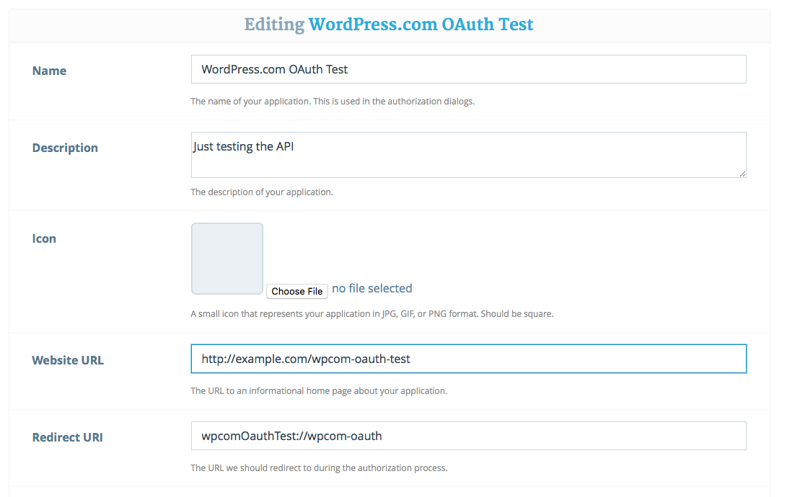
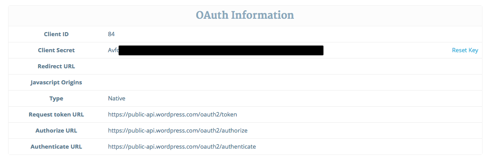
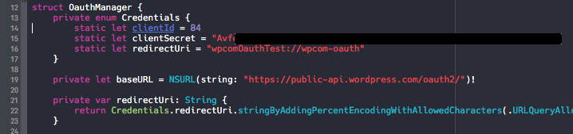
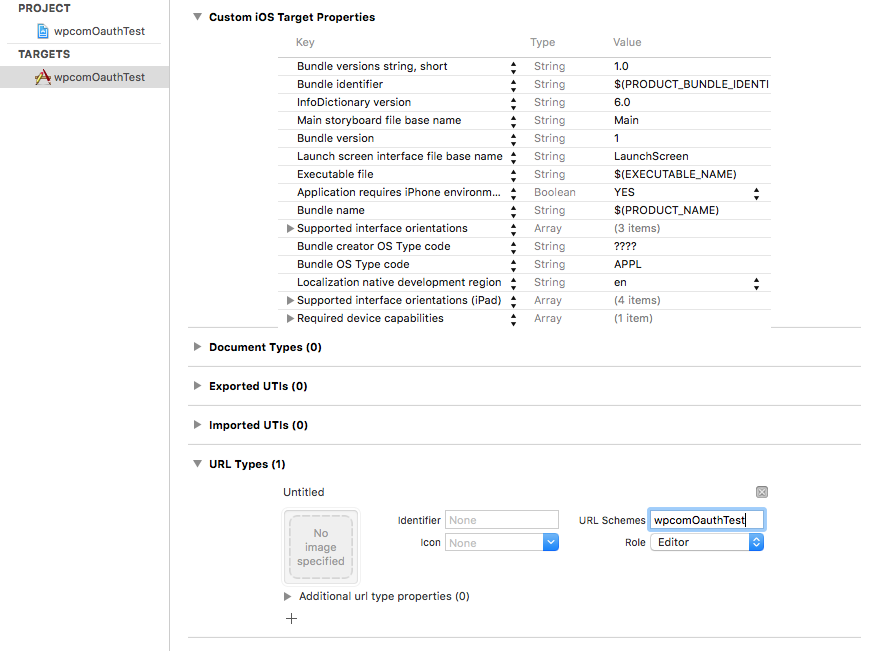
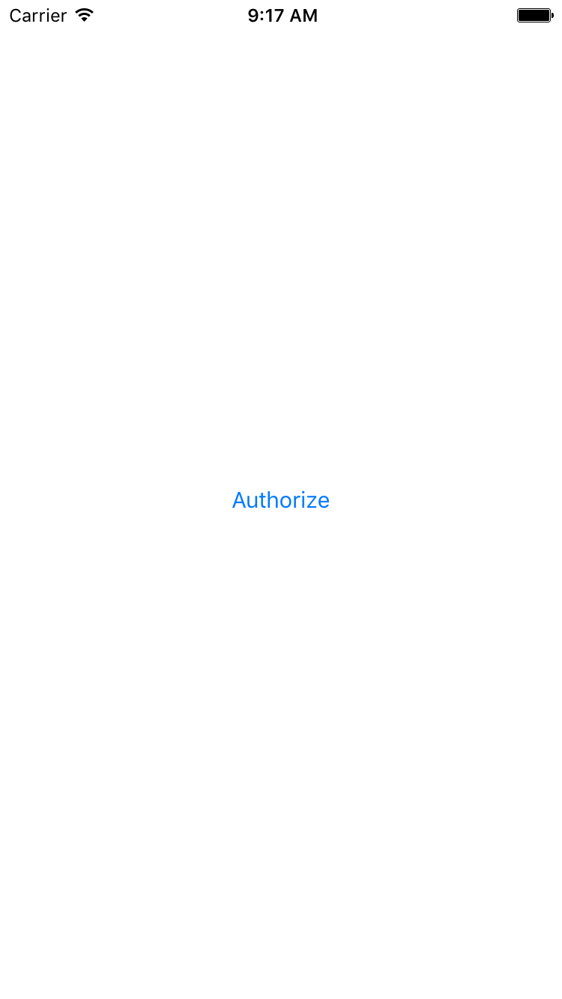
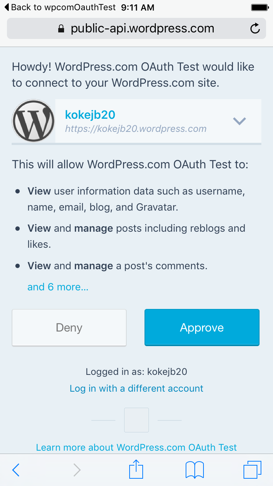
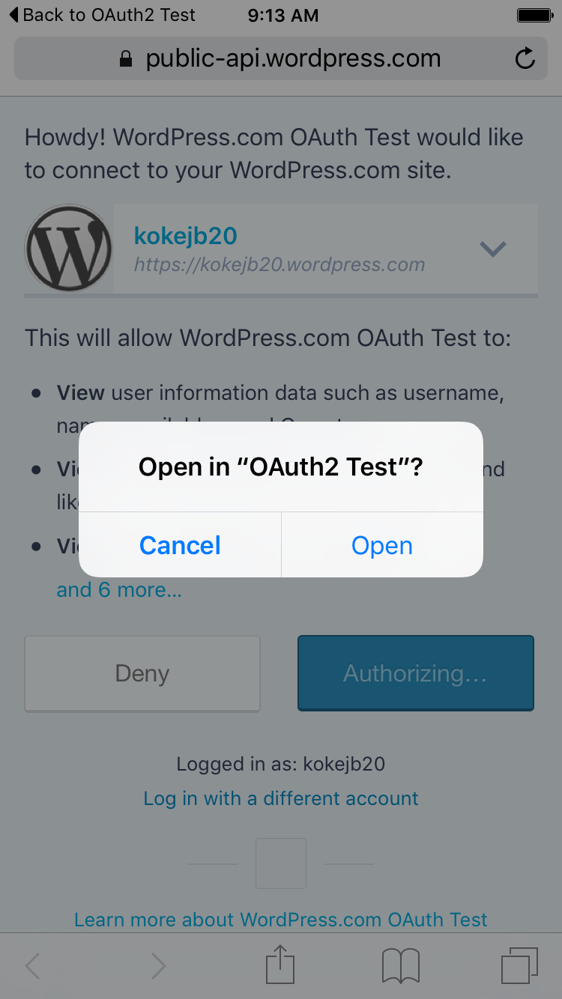
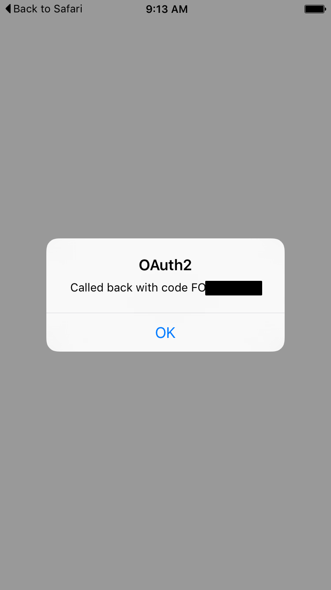

# wp.com Oauth Test

This is a simple example of how to use [WordPress.com OAuth2 authentication](https://developer.wordpress.com/docs/oauth2/) from iOS using Swift, with a custom URL scheme.

## Setup

First, you need to [create a WordPress.com app](https://developer.wordpress.com/apps/new/) if you don't have one already. In the _Redirect URL_ field, enter the custom URL for your app (e.g. `wpcomOauthTest://wpcom-oauth`).

After adding the app, note the generated Client ID and secret.

Then fill in the `Credentials` in `OauthManager.swift` with your client ID, secret, and Redirect URI. Remove the line with `CHANGE_THESE_AND_REMOVE_THIS_LINE`, it's just there so the app doesn't compile until you add your credentials.

Go to the project settings, and in the target's _Info_ tab, make sure the URL Type scheme matches your app's scheme.

## Test

Build and run the app

Tap on _Authorize_ and the app launches Safari. Log in to Wordpress.com if necessary, and approve the connection.

Safari confirms that you want to open a custom URL scheme and launch your app.

When the app is launched, it receives the authorization code. With that, your app would continue the OAuth2 flow and exchange that for a full access token.

